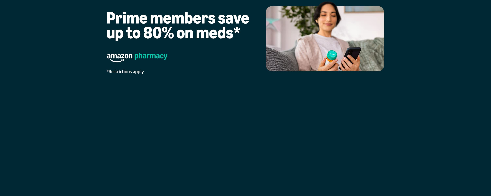
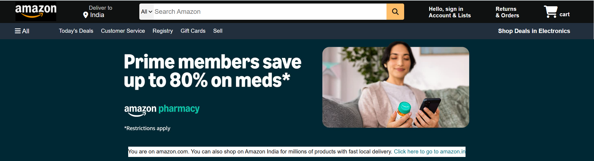
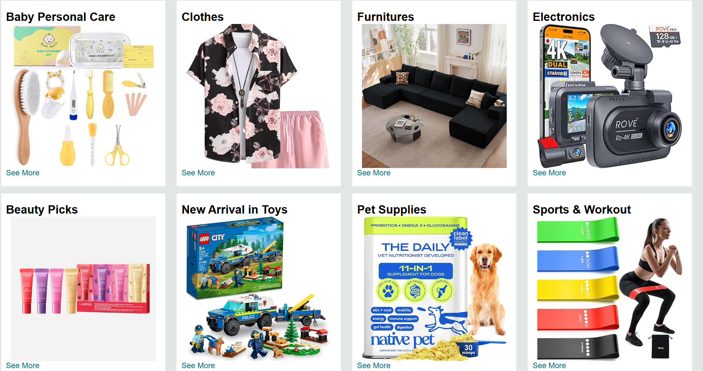
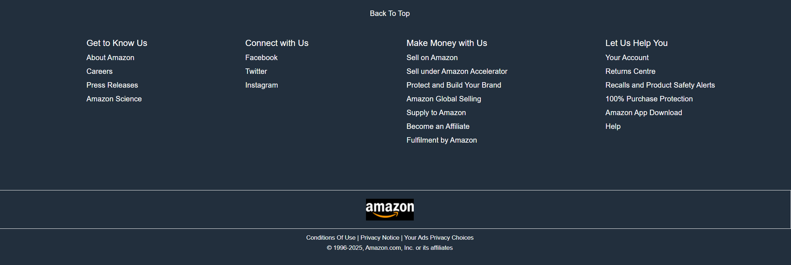

# 🛒 Amazon Clone UI  
A clean and responsive **Amazon Homepage Clone** built using **HTML and CSS**.  
This project replicates the layout and design of the real Amazon homepage, including navigation bar, hero section, category cards, and footer.

---

## ⭐ Features  
- Fully responsive Amazon-style navigation bar  
- Hero banner section  
- Product category cards  
- Clean grid layout  
- Footer section with Amazon-style links  
- Modern UI using pure HTML & CSS  
- Beginner-friendly code structure  

---

## 📸 Screenshots  

### 🔹 Hero Banner

### 🔹 Navigation Bar  

### 🔹 Homepage Sections  

### 🔹 Footer  

---

## 🛠️ Tech Stack
- **HTML5**
- **CSS3 (Flexbox + Grid)**
---

## 📁 Folder Structure
amazon-clone/
│── index.html
│── style.css
│── script.js (optional)
│── /images
│── /screenshots
│ ├── front.jpg
│ ├── header.png
│ ├── home page.png
│ ├── footer.png

---

## 🚀 How to Run Locally
1. Download or clone the repo  
2. Open `index.html` in any browser  
3. You're done! 🎉

---

## 📌 Future Improvements  
- Add Add-to-Cart feature  
- Add responsive product pages  
- Add login / signup UI  
- Convert UI to React.js version  

---

## 👩‍💻 Author  
**Pratima Adam**  
Web Developer  
GitHub: https://github.com/pratimaadamm  
LinkedIn: https://linkedin.com/in/pratima-adam-a8278717b
